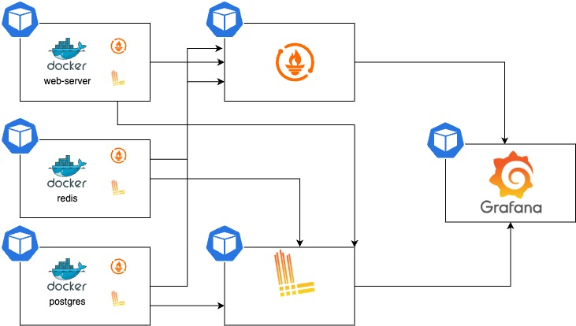

# practical-test

## Project Structure

This repository contains the following main directories:

- **pipeline**: This folder contains the pipeline configuration and scripts.
- **terraform**: This folder includes the Terraform code required to set up a Kubernetes cluster.
- **webserver**: This folder holds the application code along with its configuration requirements.

## Monitoring

Below is an example of the desired monitoring setup:

